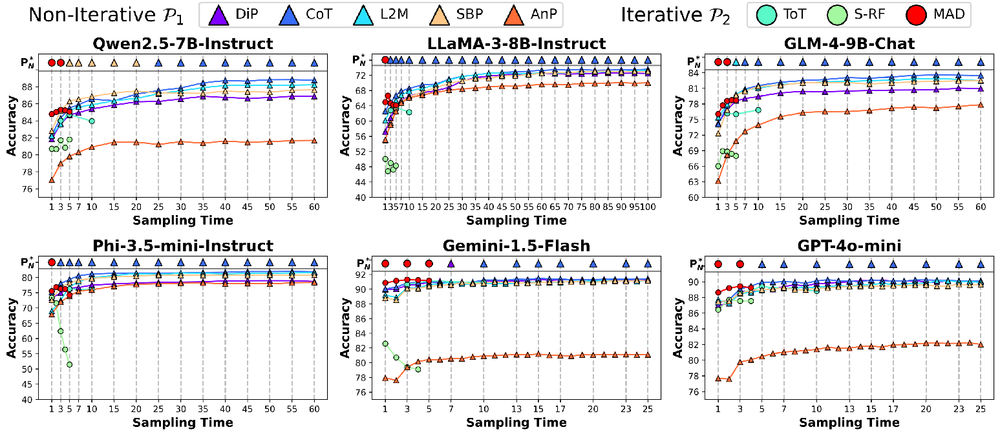

# [ACL 2025 Main] Rethinking the Role of Prompting Strategies in LLM Test-Time Scaling: A Perspective of Probability Theory

### Paper: [https://arxiv.org/abs/2505.10981](https://arxiv.org/abs/2505.10981)

[](https://opensource.org/licenses/MIT)  [](https://www.python.org/downloads/)


## Brief Introduction 📑

### Abstract
Recently, scaling test-time compute on Large Language Models (LLM) has garnered wide attention. However, there has been limited investigation of how various reasoning prompting strategies perform as scaling. In this paper, we focus on a standard and realistic scaling setting: majority voting. We systematically conduct experiments on 6 LLMs $\times$ 8 prompting strategies $\times$ 6 benchmarks. Experiment results consistently show that as the sampling time and computational overhead increase, complicated prompting strategies with superior initial performance gradually fall behind simple Chain-of-Thought. We analyze this phenomenon and provide theoretical proofs. Additionally, we propose a probabilistic method to efficiently predict scaling performance and identify the best prompting strategy under large sampling times, eliminating the need for resource-intensive inference processes in practical applications. Furthermore, we introduce two ways derived from our theoretical analysis to significantly improve the scaling performance. We hope that our research can promote to re-examine the role of complicated prompting, unleash the potential of simple prompting strategies, and provide new insights for enhancing test-time scaling performance.

### Contributions

1. **Comprehensive experiments.** Our study covers a wide range - 6 LLMs $\times$ 8 prompting strategies $\times$ 6 benchmarks, providing sufficient evidence and context to fully support the claim.
2. **Valuable findings breaking the conventional wisdom.** Our extensive experiments consistently demonstrate that a complex prompting strategy with higher pass@1 accuracy may not always be better as test-time scaling, while simple CoT/DiP gradually dominates even if with an initial inferior performance. 
3. **Rigorous theoretical analysis.** We provide an in-depth probability theoretic backed explanation of what leads to more rapid improvements with scale.
   - 3.1 **Definition of easy and hard questions by answer distribution.** The difficulty of the question is not only related to pass@1 accuracy, but determined by the probability distribution of all possible answer outputs. The accuracy of easy questions increases as scaling while hard questions reduces. 
   - 3.2 **Disturbed peaks of wrong answer distribution.** Scaling performance is affected by enormous answer distribution, and we quantify this with our theory.
4. **Practical $O(1)$ approach to predict scaling performance without resource-intensive inference**.
5. **Two effective and general methods to significantly improve scaling performance verified on multiple models and datasets.** Combining the two methods will lead to much more improvements, e.g., improving Majority@10 accuracy from 15.2% to 61.0% with LLaMA-3-8B-Instruct on MATH-500.
   - 5.1 **Adaptively scaling based on the question difficulty.**
   - 5.2 **Dynamically selecting the optimal prompting strategy based on our theory.**


## Features 🔍

- Support for multiple LLM backends (VLLM, Gemini, OpenAI and other API-based models)
  - You can specify **any model** according to your needs.
- Various reasoning prompting strategies:
  - Non-Iterative:
    - **DiP**: Direct Prompting
    - **CoT**: [Chain of Thought Prompting](https://proceedings.neurips.cc/paper_files/paper/2022/hash/9d5609613524ecf4f15af0f7b31abca4-Abstract-Conference.html?ref=https://githubhelp.com)
    - **L2M**: [Least-to-Most Prompting](https://arxiv.org/abs/2205.10625)
    - **SBP**: [Step-Back Prompting](https://arxiv.org/abs/2310.06117)
    - **AnP**: [Analogous Prompting](https://arxiv.org/abs/2310.01714)
  - Iterative:
    - **ToT**: [Tree of Thoughts](https://proceedings.neurips.cc/paper_files/paper/2023/hash/271db9922b8d1f4dd7aaef84ed5ac703-Abstract-Conference.html) 
    - **S-RF**: [Self-Refine](https://proceedings.neurips.cc/paper_files/paper/2023/hash/91edff07232fb1b55a505a9e9f6c0ff3-Abstract-Conference.html)
    - **MAD**: [Multi-Agent Debate](https://dl.acm.org/doi/abs/10.5555/3692070.3692537)
- Extensive dataset support:
  - Mathematical reasoning:
    - [GSM8K](https://arxiv.org/abs/2110.14168)
    - [GSM-Hard](https://proceedings.mlr.press/v202/gao23f) 
    - [MATH](https://arxiv.org/abs/2103.03874)
    - [AIME_2024](https://modelscope.cn/datasets/AI-ModelScope/AIME_2024)
  - Scientific reasoning:
    - [GPQA](https://arxiv.org/abs/2311.12022)
    - [MMLU](https://arxiv.org/abs/2009.03300) 
      - MMLU-high_school_physics
      - MMLU-high_school_chemistry
      - MMLU-high_school_biology
- Two different budgets for evaluation:
  - Sampling time
  - Computation overhead (Cost)

## Installation 🛠️

1. Clone the repository:
```bash
git clone https://github.com/MraDonkey/rethinking_prompting.git
cd rethinking_prompting
```

2. Create conda environment and install dependencies:
```bash
conda create -n rethinking_prompting  python=3.11
conda activate rethinking_prompting
pip install -r requirements.txt
pip install -q -U google-generativeai
```

## Configuration ⚙️

Before running the framework, you need to set up your API keys for different LLM providers:

- For vllm models:
  - You may need to login huggingface to get access to some LLMs.
- For OpenAI models or other OpenAI-like API-based models:
  - Set api_key `openai_api_key`
  - Set base_url `openai_base_url`
- For Google Gemini:
  - Set `google_api_key`
  
Complete the variables `hf_token` in `main.py` and `base_path` in `dataset.py`.

## Usage 🪛

For example, to get the inference results of all prompting strategies with Qwen2.5-7B-Instruct on GSM8K, you can run this script.

```bash
bash scripts/Qwen_GSM8K.sh
```

You can further customize hyperparameters to suit your specific requirements.

## Evaluation 🔬

To evaluate the performance of all tested prompting strategies:

```bash
python eval_csv_cost.py --model_name "your_model" --dataset "your_dataset"
python eval_csv_N.py --model_name "your_model" --dataset "your_dataset"
```

You can customize the variable `sampling_times` to adjust the points in the figure, in the style of Figure 1 and 2 in our [paper](https://arxiv.org/abs/2505.10981).



## Citation ✒️

Should you find our work beneficial to your research, we would appreciate citations to our paper and GitHub stars to support ongoing development. ⭐

```bibtex
@article{liu2025rethinking,
  title={Rethinking the Role of Prompting Strategies in LLM Test-Time Scaling: A Perspective of Probability Theory},
  author={Liu, Yexiang and Li, Zekun and Fang, Zhi and Xu, Nan and He, Ran and Tan, Tieniu},
  journal={arXiv preprint arXiv:2505.10981},
  year={2025}
}
```
